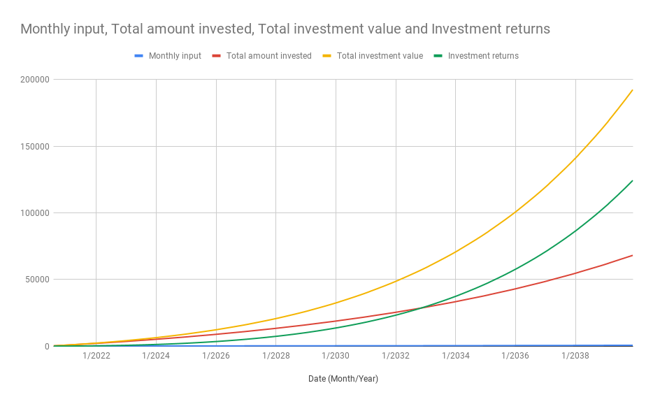
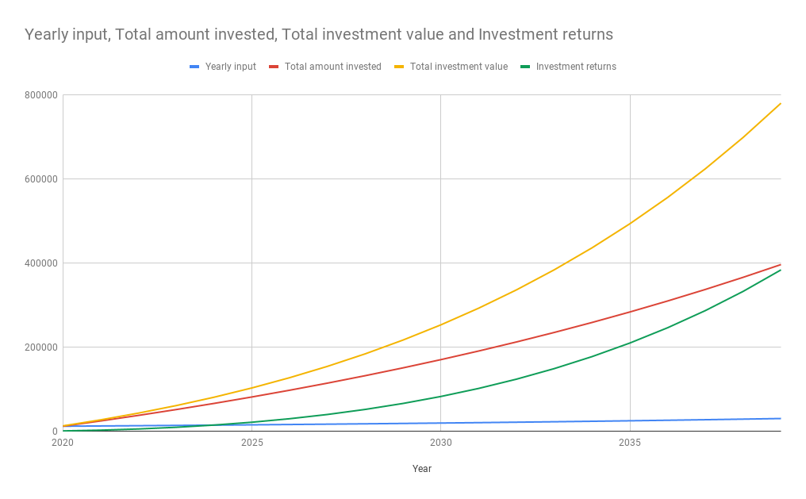

# About
-----
The tool allows you to estimate how much your investments must worth at the end of each month/year in order to meet your goal.

### What is the goal?

Reach one million by a certain age.

### What is considered an investment?
An investment is any instrument or collection of instruments, in your portfolio, able to generate the expected return in order to keep up with the monthly/yearly estimates in order to reach the goal. Some examples include, stocks, investment funds, bonds, real estate, etc.

### Why one million?
You officially become a millionaire!

The amount we feel comfortable investing and possibly losing is proportional to the total worth of our equities (say cash). A 5% of an equity of 1000, is 50, which is a small amount to be missed in case of a very volatile investment. However, this amount will probably not generate a hight enough yield either. A 5% of an equity of 1M, is 50k, which is a very large amount. However, compared to the total equity size is quite small. It is this amount that a millionaire can consider investing in a volatile opportynity and not mind losing. Lastly, this amount will generate a higher return, for example dividends, that can be used as a supplemental income.

### What is the currency?
The calculations are arithmetic so results should apply to any currency.

# How to use
-----
Currently, the tool is only available to be used from CLI.

```
usage: one-million-calculator.py [-h] -s STARTING_AMOUNT -mi MONTHLY_INPUT -ai
                                 ANNUAL_INCREASE -r ANNUAL_PERCENTAGE_GROWTH
                                 -y AMOUNT_OF_YEARS [-d DETAIL]

optional arguments:
  -h, --help            show this help message and exit
  -s STARTING_AMOUNT, --starting_amount STARTING_AMOUNT
                        The amount we have already invested.
  -mi MONTHLY_INPUT, --monthly_input MONTHLY_INPUT
                        The amount that we put into our investments every
                        month.
  -ai ANNUAL_INCREASE, --annual_increase ANNUAL_INCREASE
                        The percent that we incrase our monthly input each
                        year.
  -r ANNUAL_PERCENTAGE_GROWTH, --annual_percentage_growth ANNUAL_PERCENTAGE_GROWTH
                        The percent that our investments rise in value at the
                        end of the year.
  -y AMOUNT_OF_YEARS, --amount_of_years AMOUNT_OF_YEARS
                        The amount of years to simulate for.
  -d DETAIL, --detail DETAIL
                        mo: Monthly calculations || ye: Yearly calculations
```

## Outputs:

The generated results will be displayed on the terminal and are also saved in a CSV file. The results are split into 4 columns namely, Date (Month/Year),	Monthly input, Total amount invested, Total investment value and Investment returns.

- **Date (Month/Year)** : Shows the date
- **Monthly/yearly input** : Shows the input amount each month or year
- **Total amount invested** : The sum of all the inputs
- **Total investment value** : How much the investments are worth
- **Investment returns**: The returns from the investments when *ANNUAL_PERCENTAGE_GROWTH* is applied

## Examples

Simulate the growth of a portfolio which is starting with:
- 100 investment value
- 100 monthly investment (cash invested in stocks, etf, funds, ...)
- 10% annual increase in monthly investments
(1st year monthly investment: 1800, 2nd year monthly investment:1800+10%*1800=1980)
- 12% yearly growth
- 20 years simulation
- output the amounts with monthly details

```
python one-million-calculator.py -s 100 -mi 100 -ai 10 -r 12 -y 20 -d mo 
```



Simulate the growth of a portfolio which is starting with:
- 0 investment value
- 1000 monthly investment (cash invested in stocks, etf, funds, ...)
- 5% annual increase in monthly investments
(1st year monthly investment: 1800, 2nd year monthly investment:1800+10%*1800=1980)
- 7% yearly growth
- 20 years simulation
- output the amounts with yearly details

```
python one-million-calculator.py -s 0 -mi 1000 -ai 5 -r 7 -y 20 -d ye 
```



## What is not calculated

- instrument fees
- broker fees
- dividend payments
- ETF leakage
 

# How to use the tool

While it's impossible to predict and time the market, there is a single number that you have to take into account when assessing your investments and your investment strategy. That number is provided as an output, the `Total investment value`. This number shows how much your investments should be worth at  a specific point in time in order to keep  up with your goal.

In the simulation results we can also spot the date at which the returns from the investments surpass the monthly/yearly inputs. It is at this point that the **compound interest** can be clearly seen.


